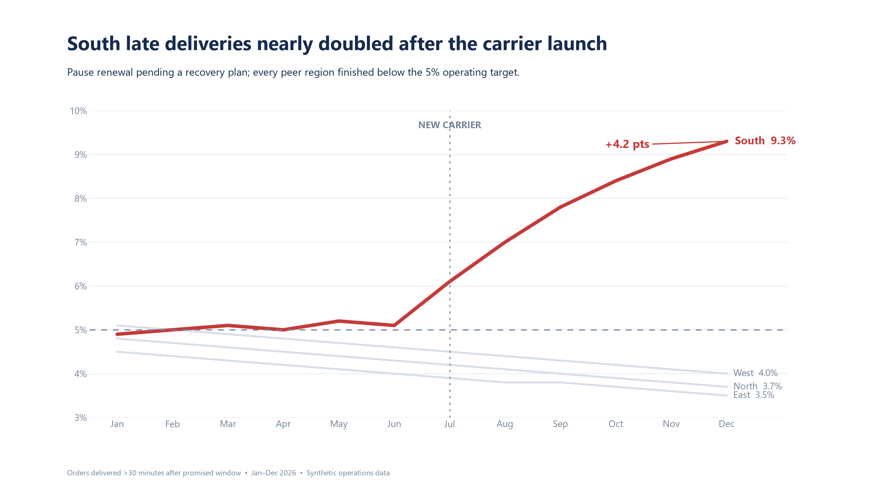
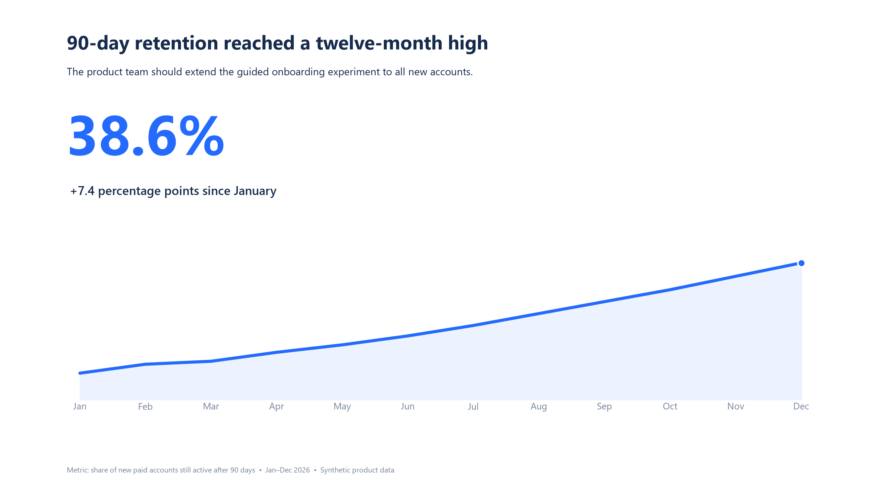
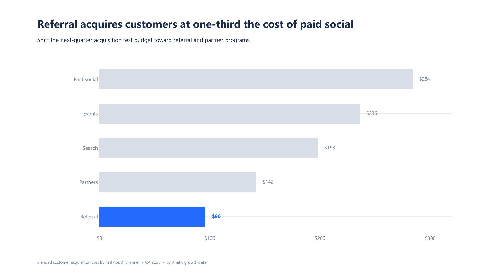
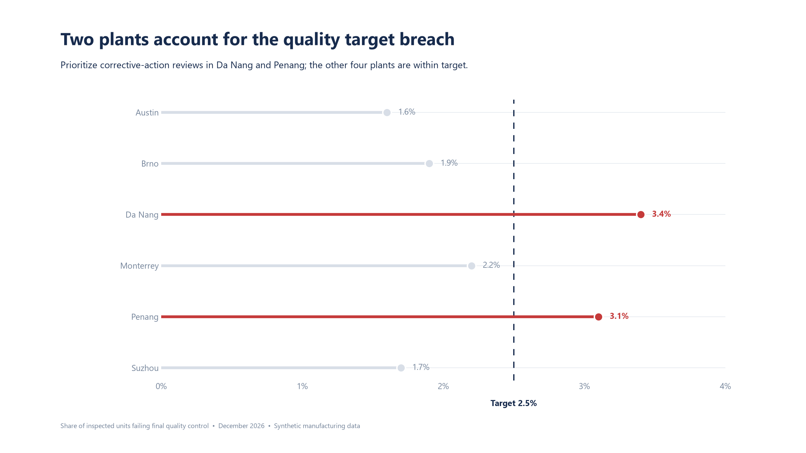
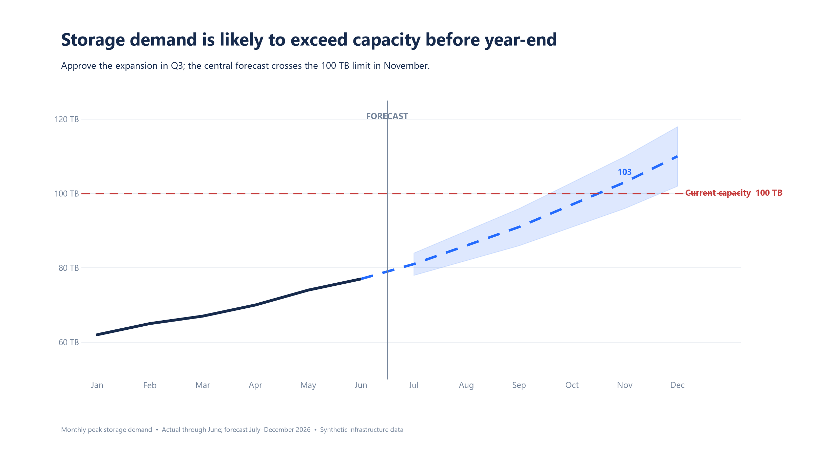
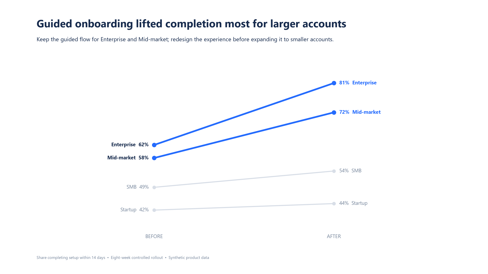
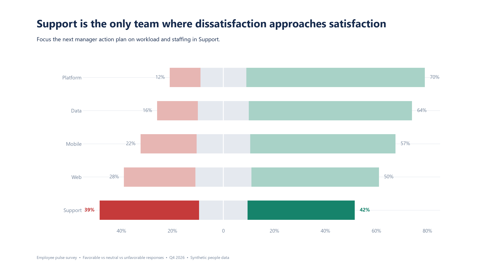
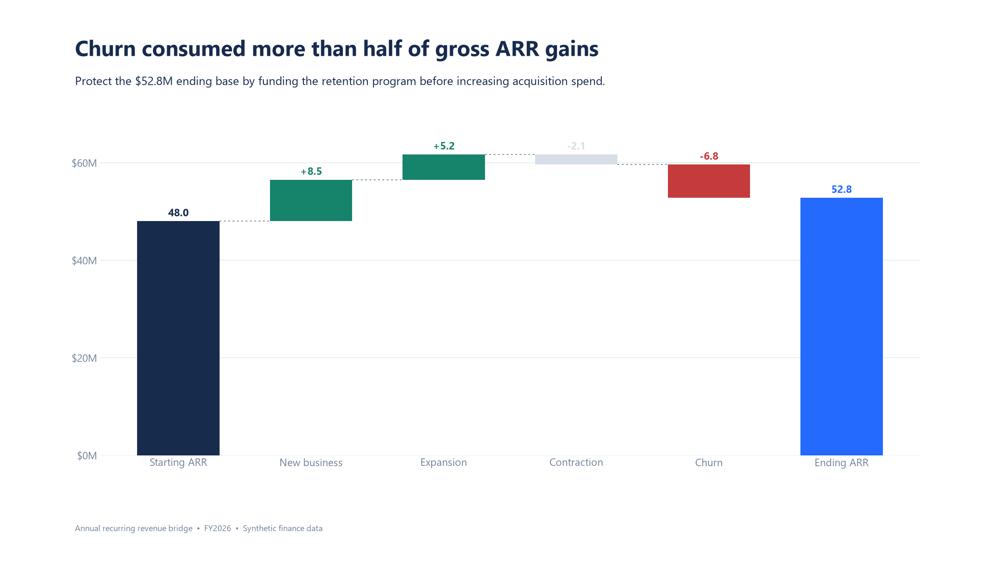
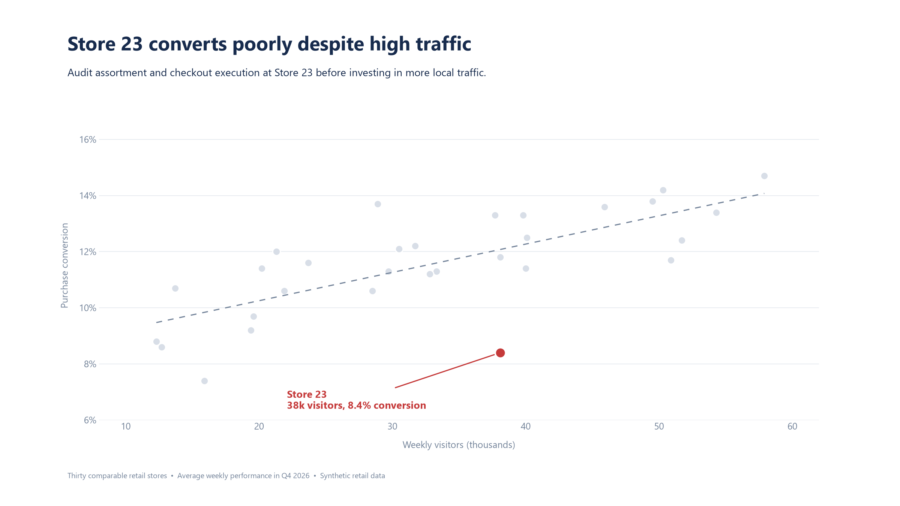
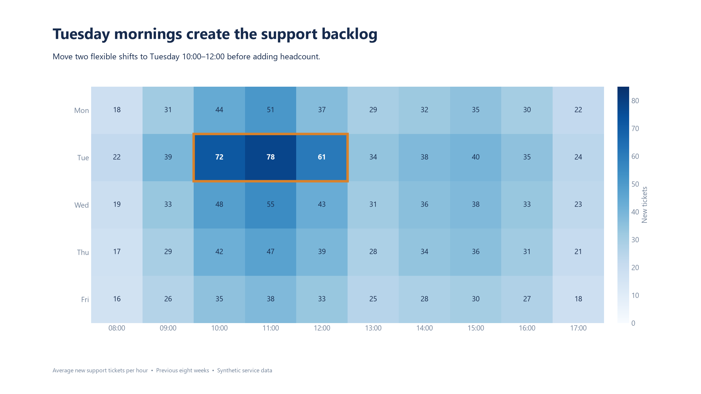

<div align="center">

# Craft Data Story Charts

**把原始业务数据转化为清晰、美观、能够直接支持决策的解释性图表。**

[](LICENSE)
[](https://agentskills.io)
[](https://skills.sh/NINTING/craft-data-story-charts)

[English](README.md) · [简体中文](README.zh-CN.md) · [示例画廊](#示例画廊) · [Skill 指令](skills/craft-data-story-charts/SKILL.md)

</div>



## 为什么需要这个 Skill

大多数制图工具都能画出线条、柱形和散点，但它们不会替你判断：受众究竟需要理解什么、哪一种比较最重要、应该突出什么，以及一张图是否已经能够推动决策。

`craft-data-story-charts` 为 AI Agent 提供了一套与具体软件无关的数据结果展示流程：

> **受众 → 决策 → 比较任务 → 中心思想 → 图表 → 视觉层级 → 实际成图检查 → 质量门槛**

这个 Skill 不限定 Matplotlib、D3、ECharts、Vega、Excel、Tableau、Power BI，也不限定编程语言。Agent 根据当前环境和交付形式选择合适的实现方式。

## 它解决什么问题

缺少数据沟通方法时，AI 很容易生成主题式标题、软件默认配色、需要反复查询的图例、大量无差别标签，以及一张无法回答“所以呢”的图。这个 Skill 强制 Agent：

- 明确具体受众与业务用途；
- 区分探索性分析和最终解释性结果；
- 绘图前先写一个与决策相关的中心思想；
- 根据比较任务选择图表，而不是采用软件默认形式；
- 使用结论性标题和直接注释；
- 保留必要背景，但让背景在视觉上后退；
- 必须生成实际成图，不能只返回代码；
- 交付前通过硬失败检查和百分制质量门槛。

## 示例画廊

以下画廊展示这个 Skill 能够指导 Agent 产出的最终视觉类型。仓库只保留成品图片，Skill 本身仍然与任何渲染技术栈无关。

| KPI 与趋势线 | 排名比较 |
|---|---|
| [](examples/01-kpi-retention.png) | [](examples/02-ranked-bars-cac.png) |

| 实际值与目标值 | 预测与不确定区间 |
|---|---|
| [](examples/03-target-dotplot-defects.png) | [](examples/10-forecast-capacity.png) |

| 前后变化斜率图 | 发散构成图 |
|---|---|
| [](examples/05-slope-onboarding.png) | [](examples/06-diverging-satisfaction.png) |

| 瀑布贡献图 | 关系与异常点 |
|---|---|
| [](examples/07-waterfall-arr.png) | [](examples/08-scatter-stores.png) |

| 密集模式热力图 | 突出式时间趋势 |
|---|---|
| [](examples/09-heatmap-support.png) | [](examples/04-highlighted-line-delivery.png) |

## 安装

### 使用 Skills CLI——推荐

```bash
npx skills add NINTING/craft-data-story-charts
```

Skills CLI 会发现 `skills/craft-data-story-charts/SKILL.md`，并为 Codex、Claude Code、Cursor、GitHub Copilot、Gemini CLI、Windsurf 等兼容 Agent 安装该技能。

### 手动安装到 Codex

把 `skills/craft-data-story-charts` 目录复制到个人 Codex Skill 目录：

```text
~/.codex/skills/craft-data-story-charts/
```

Windows 通常对应：

```text
%USERPROFILE%\.codex\skills\craft-data-story-charts\
```

安装后重新启动或打开新的 Agent 会话，使 Skill 元数据被重新发现。

## 使用

需要确保触发时，可以在任务中明确指定 Skill：

```text
使用 $craft-data-story-charts 处理 revenue_bridge.csv。

受众：CFO。
决策：在获客和留存之间分配下一季度预算。
请用代码生成一张能够独立阅读的管理层图表，输出 PNG 和 SVG，
并按照 Skill 的质量门槛反复修改，直到通过。
```

以下请求也可以自动触发这个 Skill：

- “把这份数据制作成能够支持决策的图表。”
- “改进这张仪表盘图形，让关键结果一眼可见。”
- “用这些月度指标制作一张管理层数据故事图。”
- “审核这张图表的清晰度、层级、可访问性和完整性。”

## 方法论

### 1. 建立沟通契约

明确受众、决策、主要比较任务、交付媒介和必要上下文。图表必须服务于具体用途，而不是面向模糊的“所有人”。

### 2. 提取结果

分析数据后，先写一个完整的中心思想：

```text
【结果或变化】，它之所以重要是因为【业务影响】；
因此【需要采取的决策或行动】。
```

### 3. 选择图表

根据受众需要完成的比较来选择：

| 受众任务 | 首选展示形式 |
|---|---|
| 记住一两个数值 | 大数字 |
| 查询精确值 | 表格 |
| 比较类别或排名 | 条形图或点图 |
| 查看时间趋势 | 折线图 |
| 比较两个状态 | 斜率图 |
| 查看关系 | 散点图 |
| 比较构成 | 堆叠条形图 |
| 解释各项贡献 | 瀑布图 |
| 发现二维密集模式 | 热力图 |
| 表达预测不确定性 | 区间或置信带 |

参见[完整图表选择规则](skills/craft-data-story-charts/references/chart-selection.md)。

### 4. 组织信息并建立焦点

使用结论性标题、上下文副标题、必要证据、直接标签和克制注释。把背景处理成中性色，只为主要证据保留明确的强调方式。

### 5. 生成并检查实际成图

用户要求代码时，Skill 同时要求可复现源文件和实际渲染结果。Agent 必须按交付尺寸检查成图，而不是只从代码推测效果。

### 6. 通过质量门槛

一张图只有同时满足以下条件才能通过：

- 没有硬失败；
- 总分至少 **85/100**；
- 目的与故事、理解成本、完整性分别不低于 **15/20**；
- 第一视觉落点就是预期结论或最强证据；
- 新读者不需要口头指导也能说出结果。

评分维度包括：

1. 目的与故事
2. 理解成本
3. 视觉层级与焦点
4. 美观与可访问性
5. 完整性

参见[完整质量门槛](skills/craft-data-story-charts/references/quality-gate.md)。

## 仓库结构

```text
craft-data-story-charts/
├── skills/craft-data-story-charts/
│   ├── SKILL.md
│   ├── agents/openai.yaml
│   └── references/
│       ├── chart-selection.md
│       └── quality-gate.md
├── examples/
│   └── *.png
├── README.md
├── README.zh-CN.md
├── CONTRIBUTING.md
└── LICENSE
```

## 适用范围

这个 Skill 专注于把已经形成的数据结果转换成有效的解释性展示。它与渲染软件无关，适用于报告、管理层幻灯片、仪表盘、网页和独立代码图表。

## 参与贡献

欢迎提交 Issue 和 Pull Request。提交前请阅读 [CONTRIBUTING.md](CONTRIBUTING.md)。

## 致谢

本项目是独立的开源实现，方法论受到以受众为中心的解释性数据可视化实践启发，其中包括 Cole Nussbaumer Knaflic 在 *Storytelling with Data* 中推广的原则。本项目与作者及出版社不存在隶属或背书关系。

## 许可证

[MIT](LICENSE) © 2026 NINTING
